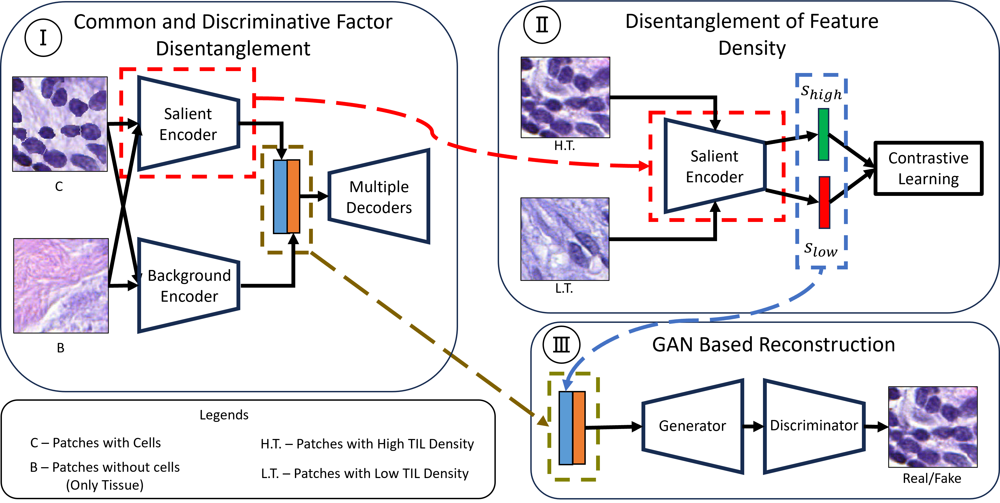

# Semi-Supervised Contrastive VAE for Disentanglement of Digital Pathology Images

**Authors: Mahmudul Hasan, Xiaoling Hu, Shaheera Abousamra, Prateek Prasanna, Joel Saltz, Chao Chen**

MICCAI 2024

## Abstract



Despite the strong prediction power of deep learning models, their interpretability remains an important concern. Disentanglement models increase interpretability by decomposing the latent space into interpretable subspaces. In this paper, we propose the first disentanglement method for pathology images. We focus on the task of detecting tumor-infiltrating lymphocytes (TIL). We propose different ideas including cascading disentanglement, novel architecture, and reconstruction branches. We achieve superior performance on complex pathology images, thus improving the interpretability and even generalization power of TIL detection deep learning models.

## Environment Setup

To set up the environment necessary for running the project, follow these steps:

1. **Install Conda**: Ensure that you have Conda installed on your system. If not, you can download it from [Miniconda](https://docs.conda.io/en/latest/miniconda.html) or [Anaconda](https://www.anaconda.com/products/individual) based on your preference.

2. **Create Conda Environment**: Navigate to the project's root directory in your terminal or command prompt. Then, use the following command to create a Conda environment from the `environment.yml` file:

    ```bash
    conda env create -f environment.yml
    ```

    This command reads the `environment.yml` file in your project directory, creating a new Conda environment with the name and dependencies specified in the file.

3. **Activate the Environment**: Once the environment is successfully created, you can activate it using:

    ```bash
    conda activate <env_name>
    ```

    Replace `<env_name>` with the name of the environment specified in the `environment.yml` file.

4. **Verify the Environment**: To ensure that the environment was set up correctly and all dependencies are installed, you can list the installed packages using:

    ```bash
    conda list
    ```

You are now ready to run the project within this Conda environment.

## Data Preprocessing

This section outlines the steps to preprocess data using the configuration specified in `./configs/brca/general_config.yaml` and the scripts located in the `Uncertainty_Estimation/SS-cVAE/data_preprocess/BRCA` folder.

### Prerequisites

Before starting the preprocessing, ensure you have activated the project's Conda environment as described in the environment setup section. This ensures all necessary dependencies are available.

### Configuration

1. **Edit Configuration**: Navigate to `./configs/brca/general_config.yaml` and review the configuration settings. Adjust any paths or parameters according to your project's needs. This configuration file controls various aspects of the preprocessing, such as input data paths, preprocessing steps to be applied, and output settings.

### Preprocessing Steps

2. **Navigate to Preprocessing Directory**: Change your working directory to the preprocessing script's location:

    ```bash
    cd Uncertainty_Estimation/SS-cVAE/data_preprocess/BRCA
    ```

3. **Run Preprocessing Script**: Execute the preprocessing script using the following command. Ensure to replace `<script_name>.py` with the actual name of the preprocessing script you intend to run.

    ```bash
    python <script_name>.py --config ../../configs/brca/general_config.yaml
    ```

    This command runs the preprocessing script with the configuration settings specified in `general_config.yaml`. The script will read the input data, apply the necessary preprocessing steps as defined in the configuration file, and save the processed data to the specified output location.

### Verification

4. **Verify Processed Data**: After the preprocessing script completes, verify the output by checking the specified output directory in the configuration file. Ensure the processed data is as expected and ready for the next steps in your project.

### Troubleshooting

- If you encounter any issues during preprocessing, ensure that the paths specified in the `general_config.yaml` are correct and accessible.
- Check the console output for any error messages that might indicate what went wrong during the preprocessing.

By following these steps, you should be able to successfully preprocess your data using the specified configuration and scripts.

## Model Training

This section provides instructions on how to train the model using the configuration specified in `Uncertainty_Estimation/SS-cVAE/configs/brca/ss_cvae.yaml` and the training script located at `Uncertainty_Estimation/SS-cVAE/train_cvae.py`.

### Prerequisites

Ensure that you have completed the data preprocessing steps as outlined in the previous sections and that your project's Conda environment is activated.

### Configuration

1. **Review and Adjust Configuration**: First, navigate to the configuration file at `Uncertainty_Estimation/SS-cVAE/configs/brca/ss_cvae.yaml`. Open this file and review the training parameters, such as the number of epochs, batch size, learning rate, and paths to the preprocessed data. Adjust any parameters as necessary to fit your project's requirements.

### Training the Model

2. **Navigate to the Training Script Directory**: Change your current working directory to where the `train_cvae.py` script is located:

    ```bash
    cd Uncertainty_Estimation/SS-cVAE
    ```

3. **Execute the Training Script**: Run the training script with the specified configuration file by executing the following command in your terminal:

    ```bash
    python train_cvae.py --config configs/brca/ss_cvae.yaml
    ```

    This command initiates the training process using the parameters defined in `ss_cvae.yaml`. The script will load the preprocessed data, build the model architecture as specified, and start the training process.

### Monitoring Training Progress

- The script will output training progress, including the current epoch, loss values, and any validation metrics defined in your configuration file. Monitor these outputs to ensure the training is proceeding as expected.

### Troubleshooting

- If the training process encounters any errors, first verify that the paths and parameters in `ss_cvae.yaml` are correctly set and that the preprocessed data is accessible.
- Check the console output for error messages that can help diagnose issues related to model architecture, data loading, or other aspects of the training process.

### Post-Training

- Upon completion, the model weights and any specified metrics will be saved to the locations defined in your configuration file. Review these outputs to evaluate the model's performance.

By following these instructions, you should be able to successfully train your model using the specified configuration and training script.

## Model Evaluation: Calculating Silhouette Score

After training your model, evaluating its performance is crucial. One way to assess the quality of the clustering produced by your model is to calculate the silhouette score. This section guides you through the process of using the `calculate_til_vs_other_silhoutte_score.py` script located in `Uncertainty_Estimation/SS-cVAE/evaluation` to calculate the silhouette score.

### Prerequisites

Ensure that the model has been trained and that you have the necessary outputs (e.g., embeddings, cluster labels) ready for evaluation.

### Calculating the Silhouette Score

1. **Navigate to the Evaluation Script Directory**: Change your current working directory to the evaluation script's location:

    ```bash
    cd Uncertainty_Estimation/SS-cVAE/evaluation
    ```

2. **Execute the Evaluation Script**: Run the `calculate_til_vs_other_silhoutte_score.py` script by executing the following command in your terminal:

    ```bash
    python calculate_til_vs_other_silhoutte_score.py --input <input_file_path> --output <output_file_path>
    ```

    - Replace `<input_file_path>` with the path to the file containing the data for which you want to calculate the silhouette score. This file should contain the embeddings or features extracted from your model, along with the cluster labels.
    - Replace `<output_file_path>` with the path where you want the silhouette score results to be saved.

    This script calculates the silhouette score, which measures how similar an object is to its own cluster compared to other clusters. The silhouette score ranges from -1 (indicating incorrect clustering) to +1 (indicating that the clusters are well apart from each other and clearly defined).

### Interpreting the Results

- A high silhouette score indicates that the model has a good distinction between clusters, suggesting effective clustering.
- Review the output file to see the calculated silhouette score and use this metric to assess the quality of the clustering performed by your model.

### Troubleshooting

- If the script fails to run, ensure that the input file path is correct and that the file is in the expected format.
- Verify that the script has access to all necessary libraries and dependencies.

By following these steps, you can calculate the silhouette score for your model's clustering, providing valuable insights into its performance.